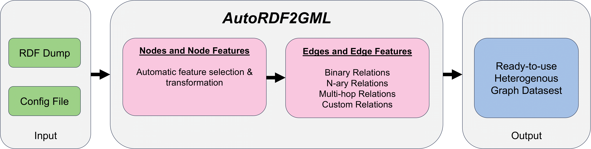

# AutoRDF2GML

AutoRDF2GML is a novel framework that semi-automatically transforms RDF data into heterogeneous graph datasets suitable for graph-based machine learning such as graph neural network (GNNs).
It bridges the gap between the Graph Machine Learning and Semantic Web communities. Its modular architecture and automatic feature selection make it easy to use, even for users who are not familiar with semantic technologies like SPARQL. AutoRDF2GML facilitates the use of large amounts of RDF data for graph-based machine learning.

<figure>
    
    <figcaption>Overview of AutoRDF2GML</figcaption>
</figure>

To use AutoRDF2GML the graph structure has to be defined in the configuration file and the path to the configuration file has to be specified in the AutoRDF2GML Python file. AutoRDF2GML then automatically generates a heterogeneous graph dataset. The output files can be easily loaded into common graph machine learning frameworks. In this [example](./create-pyg-heterodata.py), we show how the output of AutoRDF2GML (based on the RDF Knowledge Graph SemOpenAlex-SemanticWeb) can be loaded into a PyTorch Geometric HeteroData object. The structure of the loaded PyG HeteroData object as a directed graph is shown [here](./pyg-heterodata-soa-sw-directed.txt) and as an undirected graph is shown [here](./pyg-heterodata-soa-sw-undirected.txt).

### Setting Content-based Node Features

AutoRDF2GML with content-based node features is implemented in the Python script [autordf2gml-cb.py](./content-based-feature/autordf2gml-cb.py). The related template and documentation of the configuration file is defined in the [config-template.ini](./content-based-feature/config-template.ini) file.
The default model for calculating the embeddings based on the natural language descriptions is [SciBERT](https://huggingface.co/allenai/scibert_scivocab_uncased).

### Setting Topology-based Node Features

AutoRDF2GML with topology-based node features is implemented in the Python script [autordf2gml-tb.py](./topology-based-feature/autordf2gml-tb.py). The related template and documentation of the configuration file is defined in the [config-template.ini](./topology-based-feature/config-template.ini) file.
The default model for calculating the topology-based feature is [TransE](https://pytorch-geometric.readthedocs.io/en/latest/generated/torch_geometric.nn.kge.TransE.html). The default parameters are defined and commented in the implementation. 
The following models are possible with adaptation of the script: [TransE](https://pytorch-geometric.readthedocs.io/en/latest/generated/torch_geometric.nn.kge.TransE.html#torch_geometric.nn.kge.TransE), [DistMult](https://pytorch-geometric.readthedocs.io/en/latest/generated/torch_geometric.nn.kge.DistMult.html#torch_geometric.nn.kge.DistMult), [ComplEx](https://pytorch-geometric.readthedocs.io/en/latest/generated/torch_geometric.nn.kge.ComplEx.html#torch_geometric.nn.kge.ComplEx), [RotatE](https://pytorch-geometric.readthedocs.io/en/latest/generated/torch_geometric.nn.kge.RotatE.html#torch_geometric.nn.kge.RotatE).

### Example

The [example](./example) folder contains a [small RDF Knowledge Graph](./example/semopenalex-C1793878-sample.nt) (38.3mb / 259,321 RDF triples) and the corresponding [config file](./example/config-cb.ini) for the transformation. Based on the provided files you can easily try AutoRDF2GML on your local computer. To run AutoRFD2GML and transform the RDF data only the file paths have to be changed accordingly. A more detailed description is available in the [example](./example) folder.

### Use-Case: Transform SemOpenAlex-SemanticWeb

In the folder [use-case_semopenalex-semanticweb](./use-case_semopenalex-semanticweb) are the configuration files ([content-based](./use-case_semopenalex-semanticweb/config-cb.ini) and [topology-based](./use-case_semopenalex-semanticweb/config-tb.ini) setting) for the transformation of the RDF Knowledge Graph [SemOpenAlex-SemanticWeb](https://github.com/davidlamprecht/semantic-gnn-recommendation/tree/main/semopenalex-semanticweb). For the transformation we have additionally defined the [custom edge](./use-case_semopenalex-semanticweb/autordf2gml-cb-with-custom-edge.py) author-author. The folder structure of the generated heterogeneous graph dataset is shown [here](./use-case_semopenalex-semanticweb/autordf2gml-output-soa-sw.txt). 

### Use-Case: Transform Linked Papers With Code

In the folder [use-case_lpwc](./use-case_lpwc) are the configuration files ([content-based](./use-case_lpwc/config-cb.ini) and [topology-based](./use-case_lpwc/config-tb.ini) setting) for the transformation of the RDF Knowledge Graph [Linked Papers With Code](https://github.com/davidlamprecht/linkedpaperswithcode).

### Requirements

AutoRDF2GML is implementet in Python. The needed requirements are defined in [requirements.txt](./requirements.txt).
